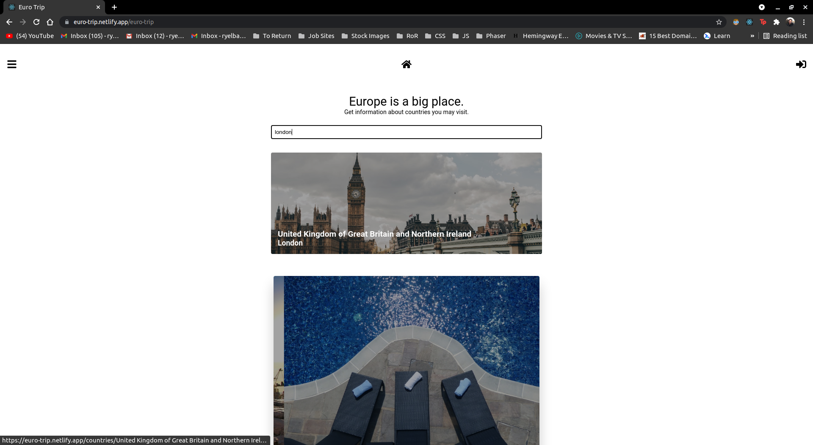

# Front-end Repo For Final Microverse Capstone Project

This project will be submitted as part of my final Microverse Capstone project. It is a front-end web application that will allow users to find some basic information about European countries and also allow adding their favourite countries to their personal favourites list. The project was built using React.

[Click here to view the backend repo](https://github.com/RyelBanfield/euro-trip-api)

## Technologies Used
- React
- React Router
- Redux

## Screenshot



## Demo

[Click here to view the live demo](https://euro-trip.netlify.app/)

## Run Locally

Clone the project

```bash
  git clone https://github.com/RyelBanfield/euro-trip.git
```

Go to the project directory

```bash
  cd my-project
```

Install dependencies

```bash
  npm i
```

Run tests

```bash
  npm run test
```

Start the server

```bash
  npm run start
```

  ## 👤 Author
**Ryel Banfield**
- [GitHub](https://github.com/ryelbanfield)
- [Twitter](https://twitter.com/ryelbanfield)
- [LinkedIn](https://www.linkedin.com/in/ryel-banfield/)

## 📝 License
This project is [MIT](LICENSE) licensed.